# Multi-RGB-D Cameras and Inertial Dataset (with Hyundai Motor Company)

**A comprehensive collection of time-synchronized RGB-D with IMU and LiDAR recordings captured by four Intel RealSense D455 cameras, a MicroStrain GX5-25 IMU, and an Ouster-64 LiDAR. Covering 360° non-overlapping views and diverse indoor/outdoor scenarios, this dataset enables research on confidence-driven multi-camera odometry, depth fusion, and scale-consistent VIO/SLAM.**

<sup>Created in collaboration with Hyundai Motor Company and released alongside our RA-L 2025 paper below.</sup>


<div align="center">

<h2>The More The Better? Confidence-Driven Residual Weighting and Depth Fusion for Multi-RGB-D Inertial Odometry</h2>

[**Seungsang Yun**](#) · [**Jaeho Shin**](#) · [**Jaekwang Cha**](#) · [**Ayoung Kim**](#*)

<sup>Seoul National University / Hyundai Motor Company</sup>

**RA-L 2025 (to appear at ICRA 2026)**

[[`Paper PDF`](https://ieeexplore.ieee.org/abstract/document/11130931)] [[`Project Video`](https://www.youtube.com/watch?v=eTlhmUA6c64)] [[`BibTeX`](#citation)]

  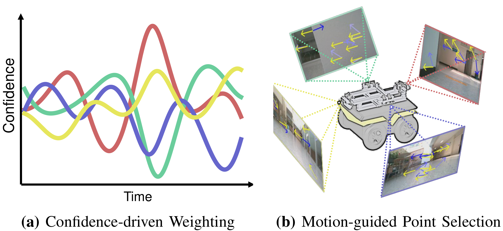
  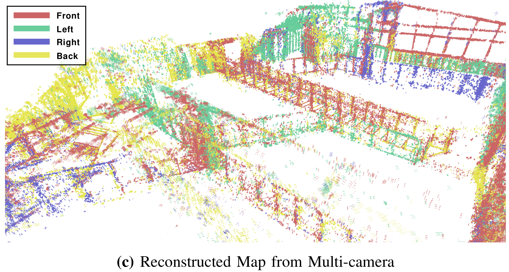

</div>

---


## 1. Dataset Features
* **Synchronized multi-sensor suite** – four hardware-triggered Intel RealSense D455 RGB-D cameras and a IMU
* **360° non-overlapping coverage** – front, back, left, and right views enable true multi-camera VO/VIO/SLAM research  
* **Challenging scenarios** – sequences include strong glare, low-light, texture-less walls, and dynamic occlusion in both indoor and outdoor environments  
* **Complete calibration package** – intrinsics, extrinsics, and camera-to-IMU SE3 transforms provided  
* **Research-ready formats** – ROS bag files, ground truth


## 2. Sensor Suite

<p align="center">
  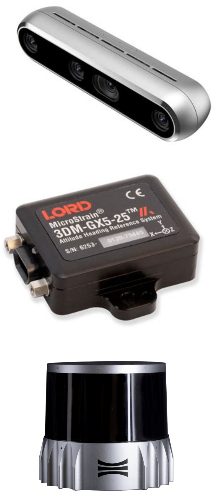
  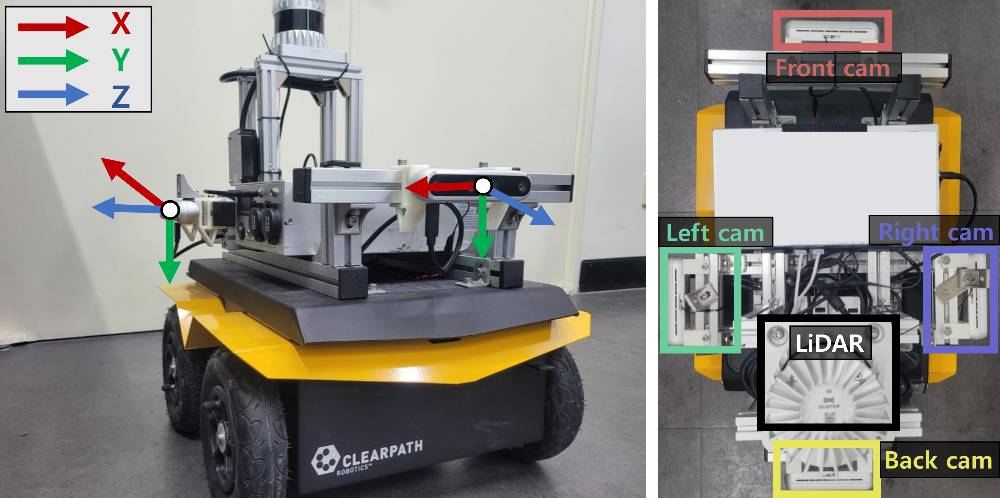
</p>

| Component | Model | Rate | Notes |
|-----------|-------|------|-------|
| **RGB-D cameras (×4)** | Intel RealSense D455 | 640 × 360 @ 30 Hz | Front / Left / Right / Back (non-overlapping FOV) |
| **IMU** | MicroStrain 3DM-GX5-25 | 100 Hz |  |
| **LiDAR** | Ouster-64 | 10 Hz | Provides ground-truth via LiDAR-Inertial SLAM |

---

## 3. Sensor Synchronization

<p align="center">
  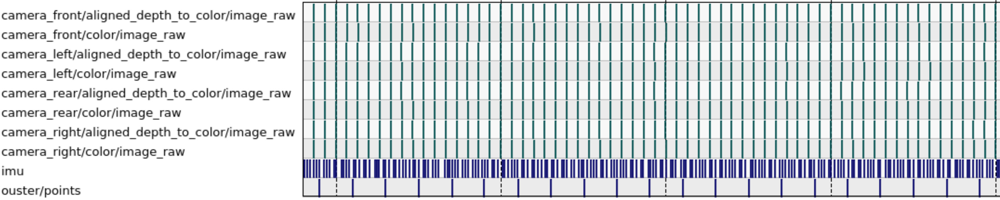
</p>
<p align="center"><sub><em>rqt_plot screenshot confirming sub-millisecond timestamp alignment across the four RGB-D camera topics.</em></sub></p>

All images and depth frames are hardware-triggered.


## 4. Sequences(The link will be accessible shortly.)
| ID         | Length        | Challenges (✓)                               | Dataset |
|------------|---------------|----------------------------------------------|---------|
| `indoor`   | 100 m / 104 s | corridor, moderate texture                  | [link](https://drive.google.com/file/d/1uy7-UXpa3LDM8zhQ6uEZnleFtaGFYbV7/view?usp=drive_link) |
| `indoor2`  |  69 m / 159 s | spacious indoor, occlusion ✓                | [link](https://drive.google.com/file/d/1cwh9N4ehBy2w2u-9lLux0SMfGlBe3Zy7/view?usp=drive_link) |
| `glare`    |  45 m / 155 s | strong sunlight glare ✓                     | [link](https://drive.google.com/file/d/1bBzP2LWhxftfbWACPSUxVSKGy0pAQTau/view?usp=drive_link) |
| `txl`      |  68 m / 150 s | texture-less walls ✓ glare ✓ dark ✓         | [link](https://drive.google.com/file/d/1DsSfANcHsrjoOXbacNhn3LNscDgQmqW_/view?usp=drive_link) |
| `occ`      |  67 m / 146 s | front-camera occlusion ✓                    | [link](https://drive.google.com/file/d/1VnVaayk-2bhdT6Nzwy5gKmpAONFdHDQX/view?usp=drive_link) |
| `dark`     |  73 m / 169 s | low light, large rotations ✓ texture-less ✓ | [link](https://drive.google.com/file/d/1p01MbeDzZnwGI_EfiTz5jC8zHcqiqZT1/view?usp=drive_link) |
| **Calibration**  | –             | intrinsics & extrinsics               | [link](https://drive.google.com/file/d/1-lHyAXZdq-Ik-u_toySdV52fC5onzmk7/view?usp=drive_link) |
| **Ground truth**| –             | LiDAR-IMU SLAM trajectories (tum foramt)| [link](https://drive.google.com/file/d/1K9YL5tfDt0aUgRUCS5C_iGVwlo5rp0ag/view?usp=drive_link) |


---
## 5. Example of Multi-camera images

#### Sequence. Indoor #1
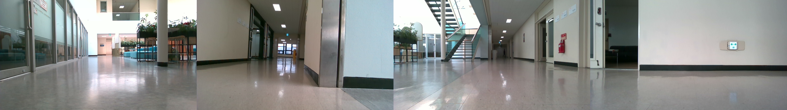

#### Sequence. Indoor #2
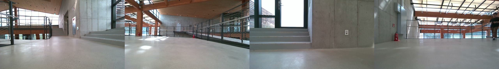

#### Sequence. Glare
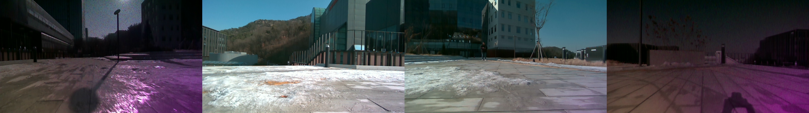

#### Sequence. Texture-less
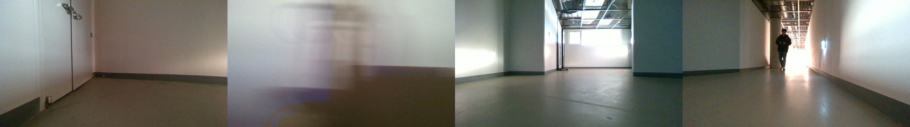

#### Sequence. Occlusion
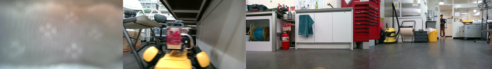

#### Sequence. Dark
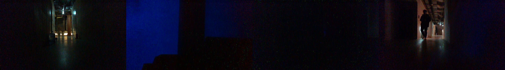


## 6. Multi-cameras and LiDAR Calibration examples

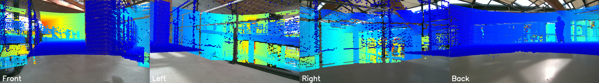
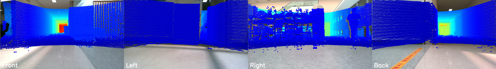
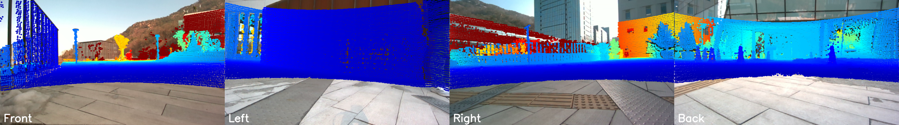

## 7. Citation


If you use this dataset, please cite our RA-L 2025 paper:

```bibtex
@ARTICLE{11130931,
  author={Yun, Seungsang and Shin, Jaeho and Cha, Jaekwang and Kim, Ayoung},
  journal={IEEE Robotics and Automation Letters}, 
  title={The More the Better? Confidence-Driven Residual Weighting and Depth Fusion for Multi-RGB-D Inertial Odometry}, 
  year={2025},
  volume={10},
  number={10},
  pages={10402-10409},
  keywords={Cameras;Odometry;Real-time systems;Optimization;Tracking;Filtering;Vectors;Robot vision systems;Pose estimation;Pipelines;RGB-D Inertial odometry;multi-camera SLAM},
  doi={10.1109/LRA.2025.3601033}
  }


```

## 8. Acknowledgement
We are deeply grateful to Hyundai Motor Company for their close collaboration and generous support throughout this project.

<p align="left">
  <a href="https://www.hyundaimotorgroup.com">
  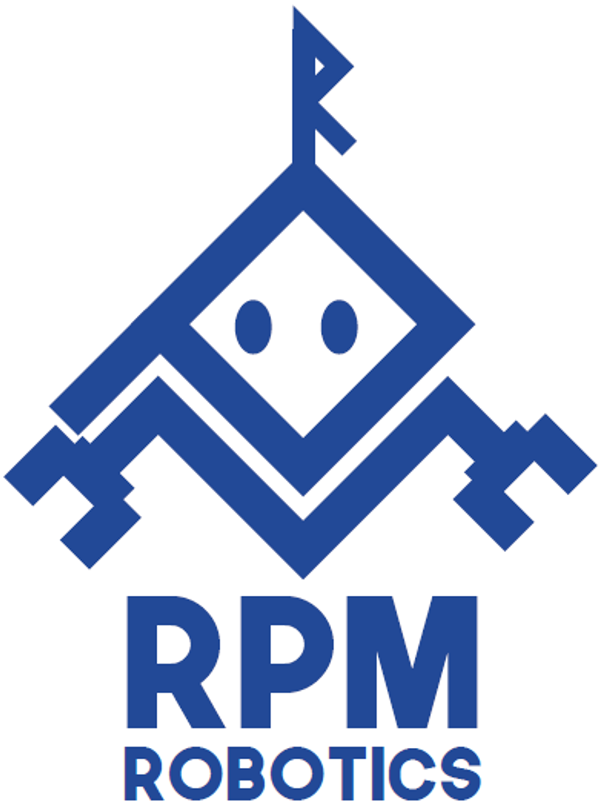
  &nbsp;&nbsp;&nbsp;
  
</p>


## 9. Contact
For any questions or issues, please contact **Seungsang Yun** at <seungsang@snu.ac.kr>.
